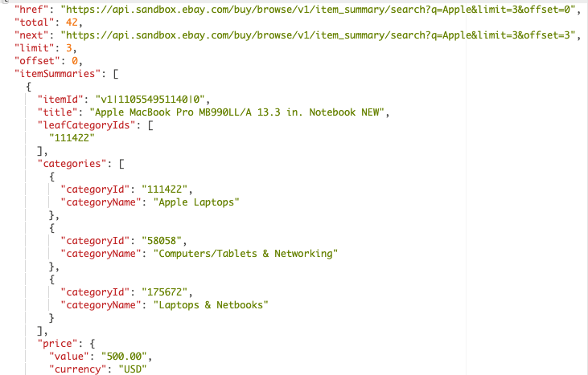

# eBay Data Scraper

With numerous e-commerce websites available, why choose eBay? While it may not be everyone's favorite e-commerce platform, I believe eBay is the best choice for this application for several important reasons.

1. **Open-Source API Support:** eBay is the most well-known e-commerce website that supports open-source API calls. Although more popular services like Facebook Marketplace and OfferUp exist, they don’t offer public APIs.

2. **Extensive Developer Support:** eBay has extensive developer support, evident through consistent updates, maintenance, and community engagement events. This robust support ensures a reliable and up-to-date API service.

3. **Vast and High-Quality Data:** eBay provides a vast quantity and quality of data, superior to other e-commerce sites like Etsy or Shopify. High-quality data is crucial for training a model to generate descriptions of everyday items people may wish to resell. Unlike Shopify and Etsy, which cater more to entrepreneurial startups, eBay's data is well-suited for this purpose.

## Signing Up to be a Developer
Signing up with eBay's developer program to access their APIs is simple and only takes a day for verification. Follow this link to sign up for API access (it's free!): [eBay Developer Program](https://developer.ebay.com/develop/get-started)

## eBay’s RESTful APIs

Yet another reason for using eBay’s API service is its transition from traditional API services to REST-based APIs. This shift is so profound that it alone justifies using this service. 

There are many reasons why REST-based APIs are superior to traditional services:

- **Scalability:** REST APIs are stateless, making them highly scalable and capable of handling large volumes of requests efficiently.
   
- **Atomicity of Calls:** Each API call in a RESTful system is atomic, meaning it is complete and self-contained. This simplifies error handling and ensures consistent interactions.

- **Flexibility:** REST APIs are flexible, allowing for multiple types of calls and data formats. They can adapt and evolve without breaking existing integrations.

- **Performance:** REST APIs leverage HTTP caching mechanisms, reducing server load and improving response times, leading to better overall performance.

eBay’s RESTful APIs encapsulate these benefits, making them a powerful tool for developing robust, scalable, and high-performing applications.

## The Right API: Buy APIs -> Browse API

With so many APIs to choose from, which one should we use? The goal is to obtain as much information about as many items as possible with minimal effort. eBay's Browse API (from the home developer page go to APIs -> RESTful APIs -> Buy APIs -> Browse API) provides the one golden call we'll need to collect tons of high-quality data: the **search** call.

Example Call Request Using search:
https://api.sandbox.ebay.com/buy/browse/v1/item_summary/search?q=Apple&limit=3

Respective Output Snippet:

## 
