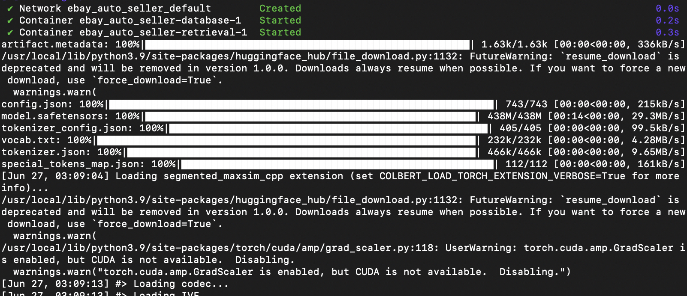

<a id="readme-top"></a>

<!-- PROJECT SHIELDS -->
<!--
*** I'm using markdown "reference style" links for readability.
*** Reference links are enclosed in brackets [ ] instead of parentheses ( ).
*** See the bottom of this document for the declaration of the reference variables
*** for contributors-url, forks-url, etc. This is an optional, concise syntax you may use.
*** https://www.markdownguide.org/basic-syntax/#reference-style-links
-->
<!-- 
[![Stargazers][stars-shield]][stars-url]
[![MIT License][license-shield]][license-url]
[![LinkedIn][linkedin-shield]][linkedin-url]
[![Issues][issues-shield]][issues-url]
-->

<!-- PROJECT LOGO -->
<br>
<div align="center">
  <a href="https://github.com/rfeinberg3/eBayAutoSeller">
    
  </a>

<h3 align="center">eBay Auto Seller</h3>

  <p align="center">
    eAS is a tool that generates aggregated item pricing and descriptions from by simply inputing an item's name. It uses ColBERT for Retrieval-Augmented Generation, eBay’s RESTful APIs, and Docker for microservice orchestration.
    <br>
    <a href="https://github.com/rfeinberg3/eBayAutoSeller/tree/main/documentation"><strong>Explore the docs »</strong></a>
    <br>
    <br>
    <a href="https://github.com/rfeinberg3/eBay_Auto_Seller">View Demo</a>
    ·
    <a href="https://github.com/rfeinberg3/eBay_Auto_Seller/issues/new?labels=bug&template=bug-report---.md">Report Bug</a>
    ·
    <a href="https://github.com/rfeinberg3/eBay_Auto_Seller/issues/new?labels=enhancement&template=feature-request---.md">Request Feature</a>
  </p>
</div>


<!-- TABLE OF CONTENTS -->
<details>
  <summary>Table of Contents</summary>
  <ol>
    <li>
      <a href="#about-the-project">About The Project</a>
      <ul>
        <li><a href="#built-with">Built With</a></li>
      </ul>
    </li>
    <li>
      <a href="#getting-started">Getting Started</a>
      <ul>
        <li><a href="#prerequisites">Prerequisites</a></li>
        <li><a href="#installation">Installation</a></li>
      </ul>
    </li>
    <li>
      <a href="#usage">Usage</a></li>
      <ul>
        <li><a href="#main-program">Main Program</a></li>
        <li><a href="#ebay-datascraping">eBay DataScraping</a></li>
      </ul>
    <li><a href="#roadmap">Roadmap</a></li>
    <li><a href="#contributing">Contributing</a></li>
    <li><a href="#license">License</a></li>
    <li><a href="#contact">Contact</a></li>
    <li><a href="#acknowledgments">Acknowledgments</a></li>
  </ol>
</details>


<!-- ABOUT THE PROJECT -->
## About The Project

![Product Name Screen Shot][product-screenshot]

eBay Auto Seller is a tool designed to generate aggregate pricing and descriptions for items that users would like to sell or resell on eBay by simply inputing the items name. Leveraging eBay's extensive API support, and ColBERT for Retrieval-Augmented Generation (RAG), this project aims to streamline the listing process by providing high-quality, autogenerated item pricing and descriptions using aggregated data. This not only saves time for sellers but also ensures that listings are detailed, price appropriate, and appealing to potential buyers.

<p align="right">(<a href="#readme-top">back to top</a>)</p>


### Built With

- [![Selenium Chrome Drivers][selenium-badge]][Selenium-url]
- [![Docker][docker-badge]][docker-url]
- [![Pandas][pandas-badge]][pandas-url]
- [![JSON][json-badge]][json-url]
- [![Google Colab][colab-badge]][colab-url]
- [![Linux][linux-badge]][linux-url]


<p align="right">(<a href="#readme-top">back to top</a>)</p>


<!-- GETTING STARTED -->
## Getting Started

This is an example of how you may give instructions on setting up your project locally.
To get a local copy up and running follow these simple example steps.

### Prerequisites
- Download Docker Desktop [here](https://www.docker.com/products/docker-desktop/).

### Installation
- Create a directory for this program, and clone this repo into it:
```sh
git clone https://github.com/rfeinberg3/eBayAutoSeller.git
cd eBayAutoSeller
```

<p align="right">(<a href="#readme-top">back to top</a>)</p>


<!-- USAGE EXAMPLES -->
## Usage

### Main Program
- Use the provided shell script for super simple start up.
```sh
sh run.sh
```
- Or run the commands yourself to initialize containers in the background and attach to the main app container.
```sh
docker compose up --build --detach
docker attach ebayautoseller-retrieval-1
docker compose down
```

- Loading the program takes around 1 minute.



- Once loaded query retrieval is almost instant!


- Control + C to exit the program. (This destroys all the containers.)

### eBay DataScraping
_For details on how the dataset for retrieval was created, or how to recreate it for yourself, please refer to the [DataScraper Directory](https://github.com/rfeinberg3/eBayAutoSeller/tree/main/DataScraper). Setup is super easy!_

<p align="right">(<a href="#readme-top">back to top</a>)</p>


<!-- ROADMAP -->
## Roadmap

- [x] Build Knowledge base using eBay's RESTful API calls to scrape item data based on keywords.
  - [x] Use Selenium Chrome Drivers to extract item descriptions burried in html and js.
- Research and test retrieval model to integrate into this program.
- [x] Create dataset builder to format data to ColBERT for indexing and retrieval.
    - [x] Index on colab.
    - [x] Create CPU functional retrieval script.
- [x] Create Dockerfiles for each microservice.
- [x] Orchestrate containers with docker compose and shell scripts (deploy ready).
- [ ] Refactor all code into classes with abstracts where applicable
- [ ] Add Typing to all classes.
- [x] Refactor main README.
- [ ] Full Stack Paradigm.
  - [ ] Write frontend with HTML, CSS, and JavaScript (and React potentially) and push to https server.
  - [ ] Refactor this repo into a dedicated backend with Flask.
  - [ ] Convert the `Dataset` directory into a dedicated Database (postgreSQL). 
- [ ] Integrate feature to scrape custom item data from eBay, given a users keyword query.
  - [ ] Dynamically update the database when this is used.
- [ ] Research, test, and integrate a gnerative model to use with this program for item description generation.


See the [open issues](https://github.com/rfeinberg3/eBayAutoSeller/issues) for a full list of proposed features (and known issues).

<p align="right">(<a href="#readme-top">back to top</a>)</p>


<!-- CONTRIBUTING -->
## Contributing

Contributions are what make the open source community such an amazing place to learn, inspire, and create. Any contributions you make are **greatly appreciated**.

If you have a suggestion that would make this better, please fork the repo and create a pull request. You can also simply open an issue with the tag "enhancement".
Don't forget to give the project a star! Thanks again!

1. Fork the Project
2. Create your Feature Branch (`git checkout -b feature/AmazingFeature`)
3. Commit your Changes (`git commit -m 'Add some AmazingFeature'`)
4. Push to the Branch (`git push origin feature/AmazingFeature`)
5. Open a Pull Request

<p align="right">(<a href="#readme-top">back to top</a>)</p>


<!-- LICENSE -->
## License

Distributed under the GNU License. See `LICENSE.txt` for more information.

<p align="right">(<a href="#readme-top">back to top</a>)</p>


<!-- CONTACT -->
## Contact

Ryan Feinberg - [LinkedIn](https://www.linkedin.com/in/rfeinberg3/) - rfeinberg3@gemail.com

<p align="right">(<a href="#readme-top">back to top</a>)</p>


<!-- ACKNOWLEDGMENTS -->
## Acknowledgments

- [eBay Developer Program](https://developer.ebay.com/develop/get-started)
- [Deploying Microservices with Docker](https://www.linode.com/docs/guides/deploying-microservices-with-docker/)
- [2023 Nvidia, "What is Retrieval-Augmented Generation, aka RAG?"](https://blogs.nvidia.com/blog/what-is-retrieval-augmented-generation/)
- [ColBERT on GitHub](https://github.com/stanford-futuredata/ColBERT?tab=readme-ov-file)

<p align="right">(<a href="#readme-top">back to top</a>)</p>


<!-- MARKDOWN LINKS & IMAGES -->
<!-- https://www.markdownguide.org/basic-syntax/#reference-style-links -->
[stars-shield]: https://img.shields.io/github/stars/rfeinberg3/eBay_Auto_Seller.svg?style=for-the-badge
[stars-url]: https://github.com/rfeinberg3/eBayAutoSeller/stargazers
[issues-shield]: https://img.shields.io/github/issues/rfeinberg3/eBay_Auto_Seller.svg?style=for-the-badge
[issues-url]: https://github.com/rfeinberg3/eBay_Auto_Seller/issues
[license-shield]: https://img.shields.io/github/license/rfeinberg3/eBay_Auto_Seller.svg?style=for-the-badge
[license-url]: https://github.com/github_username/repo_name/blob/master/LICENSE.txt
[linkedin-shield]: https://img.shields.io/badge/-LinkedIn-black.svg?style=for-the-badge&logo=linkedin&colorB=555
[linkedin-url]: https://linkedin.com/in/rfeinberg3
[product-screenshot]: images/project_graph.png
[selenium-badge]: https://img.shields.io/badge/Selenium-43B02A?style=for-the-badge&logo=Selenium&logoColor=white
[selenium-url]: https://www.selenium.dev
[docker-badge]: https://img.shields.io/badge/Docker-2CA5E0?style=for-the-badge&logo=docker&logoColor=white
[docker-url]: https://www.docker.com
[pandas-badge]: https://img.shields.io/badge/Pandas-2C2D72?style=for-the-badge&logo=pandas&logoColor=white
[pandas-url]: https://pandas.pydata.org/docs/index.html
[json-badge]: https://img.shields.io/badge/json-5E5C5C?style=for-the-badge&logo=json&logoColor=white
[json-url]: https://www.json.org/json-en.html
[colab-badge]: https://img.shields.io/badge/Colab-F9AB00?style=for-the-badge&logo=googlecolab&color=525252
[colab-url]: https://colab.research.google.com
[linux-badge]: https://img.shields.io/badge/Linux-FCC624?style=for-the-badge&logo=linux&logoColor=black
[linux-url]: https://www.linux.org
